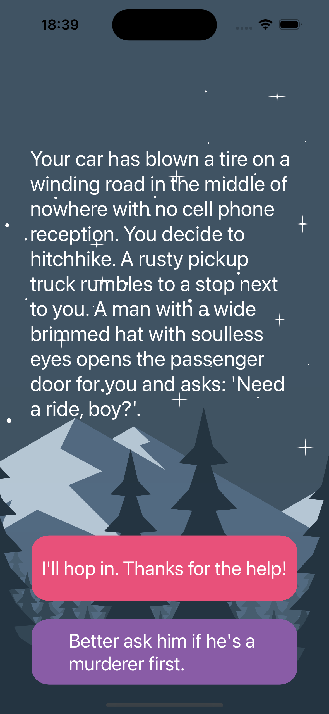

#  Destini

## My Goal

The goal of this challenge is to get you comfortable with implementing the MVC design pattern and thinking about the state of your app. In addition, I will be reviewing the concept of Swift Structures and using it to separate the Model from the Controller. 

## What I created

In this app, I created “choose your own adventure” game similar to the App Store hit “Life Line” app. The app will tell a story depending on what the user chooses and can be fleshed out and modified to provide an engaging story-telling experience
